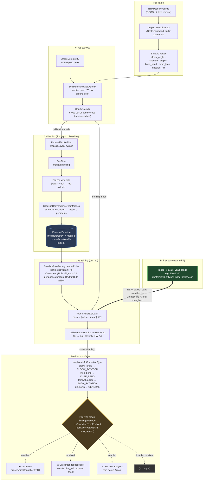

# TT Coach — how metrics flow (RTMPose live drill path)

The five in-plane metrics, where they're extracted, how the personal baseline turns them into rules, and where feedback is gated.

## The 5 metrics (`CoreMetricSpecs.ALL`)

| metricKey | Measures | Sanity bounds | Maps to CorrectionType |
|---|---|---|---|
| `elbow_angle` | elbow angle (shoulder–elbow–wrist) | 20–170° | `ELBOW_POSITION` |
| `shoulder_angle` | shoulder angle | 5–175° | `BODY_ROTATION` |
| `knee_bend` | hip–knee–ankle, 180° = straight leg | 60–180° | `KNEE_BEND` |
| `torso_lean` | facing-normalized torso lean | −60…+60° | `BODY_ROTATION` |
| `shoulder_tilt` | shoulder line tilt | −60…+60° | `BODY_ROTATION` |

Sanity bounds **drop** glitchy values from a rep — they never generate coaching cues. All angles are xScale-corrected (`ViewGeometry`), and every extractor returns `null` if a needed keypoint has `score < 0.3`.

## End-to-end flow

## Notes

- **Baseline is global on the RTM path, not per-drill.** Every RTM-eligible exercise (built-in forehand drive and all `custom_*` drills, including clones) loads the single `getActiveBaseline("forehand_drive_rtm")` ([TrainingActivity.kt:147-150](../app/src/main/java/com/ttcoachai/TrainingActivity.kt#L147-L150)). Cloned drills have no calibration of their own — they inherit this baseline; the editor's per-phase bands are their only personalization.
- **The default rule is relative, not absolute:** a rep passes when `|value − baseline mean| ≤ 2σ` (`FrameRuleEvaluator`). A value far from an editor target can still read green if it sits near the player's own calibration mean — hence the explicit editor-band override for `knee_bend` (green edge in the diagram).
- **Rhythm** (`RhythmRule ±25%` on phase durations) exists alongside the five angle metrics but produces rhythm cues, not angle cues.

## 5 metrics vs 7 correction chips

The 7 settings chips (`WRIST`, `BODY_ROTATION`, `FOLLOW_THROUGH`, `CONTACT_HEIGHT`, `ELBOW_POSITION`, `STROKE_SPEED`, `KNEE_BEND`) come from the legacy MediaPipe `StrokeAnalyzer` era. On the current RTM path the five metrics collapse onto only **3 active types**:

| Chip | RTM live path |
|---|---|
| `ELBOW_POSITION` | ✅ `elbow_angle` |
| `BODY_ROTATION` | ✅ `shoulder_angle` + `torso_lean` + `shoulder_tilt` (all three share one chip) |
| `KNEE_BEND` | ✅ `knee_bend` |
| `WRIST`, `FOLLOW_THROUGH`, `CONTACT_HEIGHT` | ❌ never emitted by the RTM path (legacy-only; wrist/contact/follow-through are 3D/ball-dependent checks the 2D pivot dropped per the trust rule) |
| `STROKE_SPEED` | ❌ dead chip — never emitted even by legacy `StrokeAnalyzer` |

`GENERAL` is the 8th enum value: it has no chip, always passes the gate, and is the fallback for unknown metric keys.
